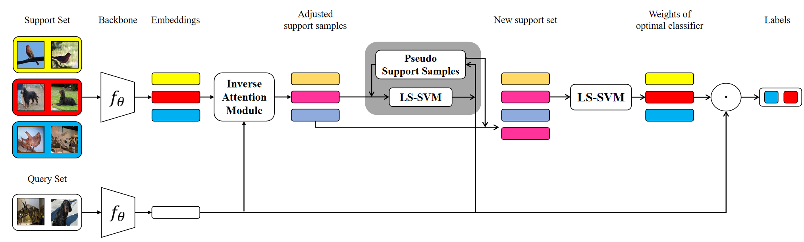

# Few-shot Classification with LS-SVM Base Learner and Transductive Modules
PyTorch implementation of:
<br>
[**Few-shot Classification with LS-SVM Base Learner and Transductive Modules**](https://arxiv.org/pdf/2009.05786.pdf)
<br>
Haoqing Wang, [Zhi-hong Deng](http://www.cis.pku.edu.cn/jzyg/szdw/dzh.htm)

## Abstract

Few-shot classification aims to recognize unseen classes with few labeled samples from each class. The base learners suitable for low-data scenarios and auxiliary information from the query samples are critical to the performance of the meta-learning models for few-shot classification. For this reason, we make the following improvements in this work: 1) we introduce multi-class least squares support vector machine as new base learner which has less computational overhead and better classification ability than existing ones; 2) further, in order to utilize the information from the query samples, we propose two transductive modules which aim to adjust the support set basing on the query samples and can be conveniently applied to various base learners to improve their few-shot classification accuracy. Combining the above improvements, we get the final model, FSLSTM (Few-Shot classification with LS-svm base learner and Transductive Modules). We conduct extensive experiments and ablation studies on mini-ImageNet and CIFAR-FS few-shot classification benchmarks. Experimental results show FSLSTM outperforms recent transductive meta-learning models, and ablation studies verify the effectiveness of each of our improvements.

<p align='center'>
  
</p>

## Citation

If you use this code for your research, please cite our paper:
```
@article{wang2020few,
  title={Few-shot Learning with LSSVM Base Learner and Transductive Modules},
  author={Wang, Haoqing and Deng, Zhi-Hong},
  journal={arXiv preprint arXiv:2009.05786},
  year={2020}
}
```

## Dependencies
* Python 3.5+
* [PyTorch 1.4.0](http://pytorch.org)
* [qpth 0.0.15](https://github.com/locuslab/qpth)
* [tqdm](https://github.com/tqdm/tqdm)

## Usage

### Datasets
Download and decompress the mini-ImageNet and CIFAR-FS datasets.

1. [mini-ImageNet](https://drive.google.com/file/d/1Sfw83MwZH-c0jAuSyUrDbFlYJ-KRpCXn/view?usp=sharing)
   
   It contains 100 classes with 600 images of size 84x84 in each class, which are built upon the ImageNet dataset. The 100 classes are divided into 64, 16, 20 for meta-training, meta-validation and meta-testing, respectively.

2. [CIFAR-FS](https://drive.google.com/file/d/1ZrdrqQbZ-Pa752WpaAWDVRcUTBUYeBoP/view?usp=sharing)

   It contains 100 classes with 600 images of size 32x32 in each class, which are built upon the CIFAR-100 dataset. The 100 classes are divided into 64, 16, 20 for meta-training, meta-validation and meta-testing, respectively.

### Pre-training
To explore the impact of using the network parameters pre-trained with large dataset as the initialization on the final classification results, we pre-train the backbone with [Places365-standard dataset](http://data.csail.mit.edu/places/places365/places365standard_easyformat.tar).

1. Download and decompress the Place365-standard dataset.
   ```
   cd ./pre_train
   wget http://data.csail.mit.edu/places/places365/places365standard_easyformat.tar
   tar -xf places365standard_easyformat.tar
   ```
2. Pre-train the ResNet12 and Conv4 for mini-ImageNet (84x84) and CIFAR-FS (32x32).
   ```
   cd ./pre_train
   python pretrain_Conv4.py --resize 36 --img_size 32 --filename Conv4_32
   python pretrain_Conv4.py --resize 92 --img_size 84 --filename Conv4_84
   
   python pretrain_ResNet12.py --resize 36 --img_size 32 --filename ResNet12_32
   python pretrain_ResNet12.py --resize 92 --img_size 84 --filename ResNet12_84
   ```

### Meta-training
1. To train different base learners without the Inverse Attention Module:
   ```
   python train.py --gpu 0,1,2,3 --save_path 'Logs/CIFAR_FS_Conv4_LSSVM' --pretrain 'Logs/pretrain/Conv4_32_best.pth' --lr 5e-3 --train_shot 5 --val_shot 5 --head LSSVM --network Conv4 --dataset CIFAR_FS
   python train.py --gpu 0,1,2,3 --save_path 'Logs/CIFAR_FS_ResNet12_LSSVM' --pretrain 'Logs/pretrain/ResNet12_32_best.pth' --lr 5e-4 --train_shot 5 --val_shot 5 --head LSSVM --network ResNet12 --dataset CIFAR_FS
   
   python train.py --gpu 0,1,2,3 --save_path 'Logs/miniImageNet_Conv4_LSSVM_5s' --pretrain 'Logs/pretrain/Conv4_84_best.pth' --lr 5e-3 --train_shot 15 --val_shot 5 --head LSSVM --network Conv4 --dataset miniImageNet
   python train.py --gpu 0,1,2,3 --save_path 'Logs/miniImageNet_ResNet12_LSSVM_5s' --pretrain 'Logs/pretrain/ResNet12_84_best.pth' --lr 5e-4 --train_shot 15 --val_shot 5 --head LSSVM --network ResNet12 --dataset miniImageNet
   ```
   Set `--head` to `NN`, `RR` or `SVM` for other base learners.
2. To train different base learners with our Inverse Attention Module:
   ```
   python train_IAM.py --gpu 0,1,2,3 --save_path 'Logs/CIFAR_FS_Conv4_LSSVM_IAM' --pretrain 'Logs/pretrain/Conv4_32_best.pth' --dim 2048 --reduction 8 --IAM_lr 1e-2 --lr 5e-3 --train_shot 5 --val_shot 5 --head LSSVM --network Conv4 --dataset CIFAR_FS
   python train_IAM.py --gpu 0,1,2,3 --save_path 'Logs/CIFAR_FS_ResNet12_LSSVM_IAM' --pretrain 'Logs/pretrain/ResNet12_32_best.pth' --dim 2560 --reduction 8 --IAM_lr 5e-3 --lr 5e-4 --train_shot 5 --val_shot 5 --head LSSVM --network ResNet12 --dataset CIFAR_FS
   
   python train_IAM.py --gpu 0,1,2,3 --save_path 'Logs/miniImageNet_Conv4_LSSVM_IAM_5s' --pretrain 'Logs/pretrain/Conv4_84_best.pth' --dim 4608 --reduction 32 --IAM_lr 1e-2 --lr 5e-3 --train_shot 15 --val_shot 5 --head LSSVM --network Conv4 --dataset miniImageNet
   python train_IAM.py --gpu 0,1,2,3 --save_path 'Logs/miniImageNet_ResNet12_LSSVM_IAM_5s' --pretrain 'Logs/pretrain/ResNet12_84_best.pth' --dim 5760 --reduction 16 --IAM_lr 5e-3 --lr 5e-4 --train_shot 15 --val_shot 5 --head LSSVM --network ResNet12 --dataset miniImageNet
   ```

### Meta-testing
1. To test the base learners without our transductive modules:
   ```
   python test.py --gpu 0,1,2,3 --load 'Logs/CIFAR_FS_ResNet12_LSSVM/best_model.pth' --episode 10000 --way 5 --shot 5 --query 15 --head LSSVM --network ResNet12 --dataset CIFAR_FS
   python test.py --gpu 0,1,2,3 --load 'Logs/miniImageNet_ResNet12_LSSVM_5s/best_model.pth' --episode 10000 --way 5 --shot 5 --query 15 --head LSSVM --network ResNet12 --dataset miniImageNet
   ```
   Set `--head` to `NN`, `RR` or `SVM` for other base learners.
2. To test the base learners with our Inverse Attention Module:
   ```
   python test_IAM.py --gpu 0,1,2,3 --load 'Logs/CIFAR_FS_ResNet12_LSSVM_IAM/best_model.pth' --dim 2560 --reduction 8 --episode 10000 --way 5 --shot 5 --query 15 --head LSSVM --network ResNet12 --dataset CIFAR_FS
   python test_IAM.py --gpu 0,1,2,3 --load 'Logs/miniImageNet_ResNet12_LSSVM_IAM_5s/best_model.pth' --dim 5760 --reduction 16 --episode 10000 --way 5 --shot 5 --query 15 --head LSSVM --network ResNet12 --dataset miniImageNet
   ```
3. To test the base learners with our Inverse Attention Module and Pseudo Support Module:
   ```
   python test_IAM.py --gpu 0,1,2,3 --load 'Logs/CIFAR_FS_ResNet12_LSSVM_IAM/best_model.pth' --psm_iters 10 --dim 2560 --reduction 8 --episode 10000 --way 5 --shot 5 --query 15 --head LSSVM --network ResNet12 --dataset CIFAR_FS
   python test_IAM.py --gpu 0,1,2,3 --load 'Logs/miniImageNet_ResNet12_LSSVM_IAM_5s/best_model.pth' --psm_iters 10 --dim 5760 --reduction 16 --episode 10000 --way 5 --shot 5 --query 15 --head LSSVM --network ResNet12 --dataset miniImageNet
   ```

## Acknowledgments
This code is based on the implementations of [**MetaOptNet**](https://github.com/kjunelee/MetaOptNet).